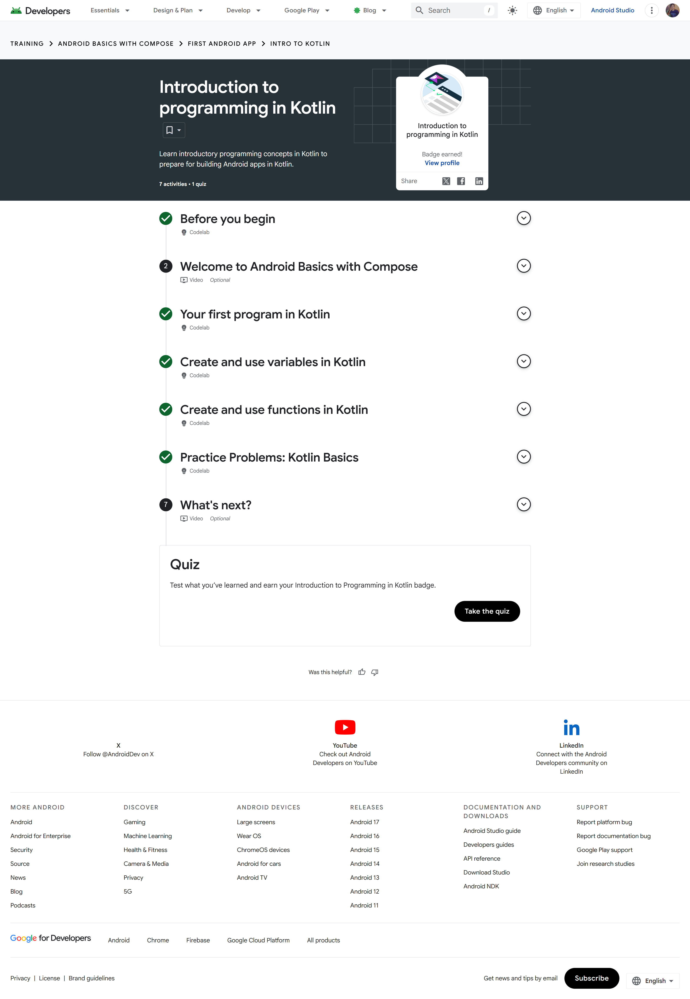
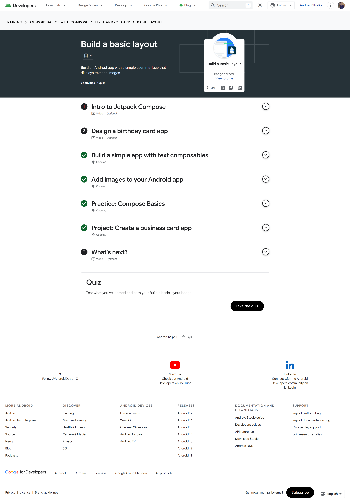

# Module 1 - Your First Android App

> **Android Basics with Compose, Unit 1**
> Foundation: Kotlin, Android Studio, project structure, and basic Compose layouts

[← Portfolio home](../README.md) | [Analysis](Analysis.md) | [Badge evidence](Badge-Evidence/) | [Source code](Source-Code/) | [Next module →](../Module-2-Jetpack-Compose/README.md)

## Module overview

This unit establishes the language, tooling, and UI foundations needed for Android development. The learning sequence starts with introductory Kotlin, moves through Android Studio setup and application execution, and finishes with a basic Compose layout containing text and images.

## Pathway completion

| Pathway | Main topics | Evidence |
|---|---|---|
| Introduction to programming in Kotlin | Program structure, variables, functions, Kotlin practice problems | [Badge screenshot](Badge-Evidence/introduction-to-kotlin.png) |
| Set up Android Studio | IDE installation, project creation, emulator/device execution | [Badge screenshot](Badge-Evidence/setup-android-studio.png) |
| Build a Basic Layout | Composable functions, text, images, modifiers, simple layout composition | [Badge screenshot](Badge-Evidence/build-basic-layout.png) |

The [Unit 1 completion screenshot](Screenshots/unit-1-completion.png) records all three pathways at 100%.

## Evidence gallery

| Introduction to programming in Kotlin | Set up Android Studio | Build a Basic Layout |
|---|---|---|
| [](Badge-Evidence/introduction-to-kotlin.png) | [](Badge-Evidence/setup-android-studio.png) | [](Badge-Evidence/build-basic-layout.png) |

## Learning outcomes evidenced

- Recognize the basic structure of a Kotlin program and use variables and functions to organize behaviour.
- Create an Android Studio project and understand the roles of the app module, manifest, source sets, resources, and Gradle configuration.
- Run an Android application through an emulator or connected device workflow.
- Use `ComponentActivity.setContent` to define an activity UI with Jetpack Compose.
- Build small reusable composables, pass parameters, apply modifiers, and inspect a UI with `@Preview`.
- Apply a Material 3 theme and use a `Scaffold` to respect the content area of an edge-to-edge layout.

## Included implementation

[`Source-Code/FirstAndroidPortfolioApp`](Source-Code/FirstAndroidPortfolioApp/) is the complete local Android Studio project for this module.

### Important files

| File | Purpose |
|---|---|
| [`MainActivity.kt`](Source-Code/FirstAndroidPortfolioApp/app/src/main/java/com/example/firstandroidportfolioapp/MainActivity.kt) | Activity entry point, `setContent`, themed `Scaffold`, `Greeting` composable, and preview |
| [`AndroidManifest.xml`](Source-Code/FirstAndroidPortfolioApp/app/src/main/AndroidManifest.xml) | Application and launch-activity declaration |
| [`Theme.kt`](Source-Code/FirstAndroidPortfolioApp/app/src/main/java/com/example/firstandroidportfolioapp/ui/theme/Theme.kt) | Compose Material theme configuration |
| [`libs.versions.toml`](Source-Code/FirstAndroidPortfolioApp/gradle/libs.versions.toml) | Central dependency and plugin versions |
| [`ExampleUnitTest.kt`](Source-Code/FirstAndroidPortfolioApp/app/src/test/java/com/example/firstandroidportfolioapp/ExampleUnitTest.kt) | Local JVM unit-test example |
| [`ExampleInstrumentedTest.kt`](Source-Code/FirstAndroidPortfolioApp/app/src/androidTest/java/com/example/firstandroidportfolioapp/ExampleInstrumentedTest.kt) | Device/emulator test example |

### Application flow

```text
Android launches MainActivity
        ↓
onCreate() enables edge-to-edge drawing
        ↓
setContent applies FirstAndroidPortfolioAppTheme
        ↓
Scaffold supplies safe inner padding
        ↓
Greeting composable renders "Hello Android!"
```

## Technical synthesis

The implementation is intentionally small, which makes the relationship between the Android activity lifecycle and the Compose UI boundary easy to inspect. `MainActivity` remains responsible for platform entry, while `Greeting` describes the visible UI as a function of its `name` parameter. This separation improves previewability and reuse compared with placing all UI logic directly inside `onCreate`.

`Scaffold` and `Modifier.padding(innerPadding)` are important even in a basic example: they show how layout containers communicate safe content insets to their children. The approach is effective for a starter application, although a larger app would need additional layers for navigation, state ownership, business logic, and data access.

## Build and verification

Open [`FirstAndroidPortfolioApp`](Source-Code/FirstAndroidPortfolioApp/) in Android Studio and allow Gradle synchronization to complete. With a configured JDK and Android SDK, local tests can be executed from the project folder:

```powershell
.\gradlew.bat testDebugUnitTest
```

The machine-specific `local.properties` file and generated build outputs are intentionally excluded from version control.

## Reviewer checklist

- [x] Three individual pathway screenshots
- [x] Unit-level 100% completion screenshot
- [x] Complete Android Studio/Gradle project
- [x] Kotlin and Compose implementation
- [x] Unit and instrumented test examples
- [x] Separate [analysis notes](Analysis.md)

---

[← Portfolio home](../README.md) | [View Unit 1 analysis](Analysis.md) | [Continue to Module 2 →](../Module-2-Jetpack-Compose/README.md)
