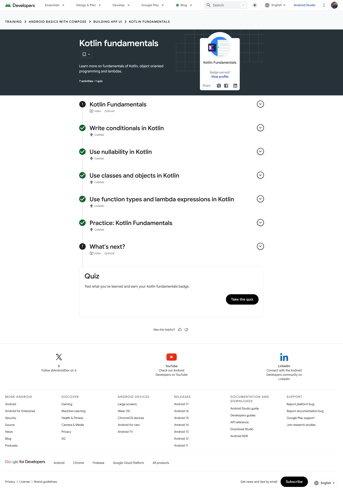
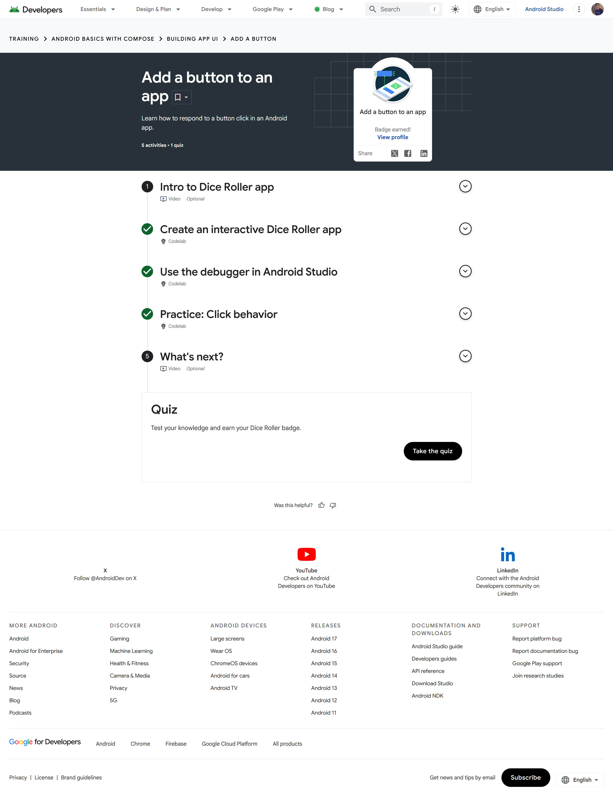
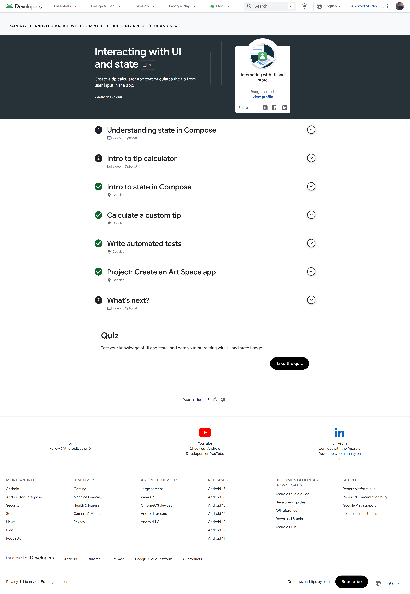

# Module 2 - Building App UI

> **Android Basics with Compose, Unit 2**
> Declarative UI, Kotlin language features, interaction, state, and testing

[← Module 1](../Module-1-Android-Basics/README.md) | [Portfolio home](../README.md) | [Analysis](Analysis.md) | [Badge evidence](Badge-Evidence/) | [Source code](Source-Code/) | [Next module →](../Module-3-Lists-Material-Design/README.md)

## Module overview

This unit develops the skills needed to build interactive Compose interfaces. Its three pathways connect deeper Kotlin concepts with event handling and state-driven UI: first strengthening language fundamentals, then responding to button clicks, and finally using user input to calculate and display changing values.

## Pathway completion

| Pathway | Main topics | Evidence |
|---|---|---|
| Kotlin Fundamentals | Conditionals, nullability, classes, objects, function types, lambda expressions | [Badge screenshot](Badge-Evidence/kotlin-fundamentals.png) |
| Add a button to an app | Interactive composables, click handlers, debugging, event behaviour | [Badge screenshot](Badge-Evidence/add-a-button-to-an-app.png) |
| Interacting with UI and state | Compose state, text input, derived values, automated UI tests | [Badge screenshot](Badge-Evidence/interacting-with-ui-and-state.png) |

The [Unit 2 completion screenshot](Screenshots/unit-2-completion.png) records all three pathways at 100%.

## Evidence gallery

| Kotlin Fundamentals | Add a button to an app | Interacting with UI and state |
|---|---|---|
| [](Badge-Evidence/kotlin-fundamentals.png) | [](Badge-Evidence/add-a-button-to-an-app.png) | [](Badge-Evidence/interacting-with-ui-and-state.png) |

## Learning outcomes evidenced

- Use conditional expressions, nullable types, classes, objects, and lambdas in Kotlin.
- Model the screen as composable functions instead of manually mutating a view hierarchy.
- Connect user actions to callbacks such as a button's `onClick` event.
- Understand recomposition: a composable can be evaluated again when observed state changes.
- Distinguish state from events and keep a clear, one-directional flow from input to updated UI.
- Use debugging and automated tests to check behaviour rather than relying only on visual inspection.

## Included implementation

[`Source-Code/ComposePortfolioDemo/MainActivity.kt`](Source-Code/ComposePortfolioDemo/MainActivity.kt) is a selected implementation retained from this module. It contains:

- a `ComponentActivity` platform entry point;
- a `setContent` Compose boundary; and
- a small reusable `PortfolioGreeting` composable.

```kotlin
setContent { PortfolioGreeting() }
```

The file is a focused source sample rather than a complete standalone Gradle project. The module's learning completion is independently documented by the three individual badge screenshots and the unit-level completion screenshot.

## Technical synthesis

Compose uses a declarative model: code states what the UI should display for the current inputs, while the framework coordinates rendering and updates. This is different from an imperative approach where code locates views and mutates their properties step by step. Declarative UI tends to make small components easier to preview and combine, but it requires disciplined state ownership because unclear state placement can create duplicated data or unpredictable updates.

The selected greeting sample demonstrates the smallest useful Compose boundary. The completed pathway evidence covers broader interactions—including button behaviour, text input, calculated state, and testing—that are not all reproduced in this single retained source file. Keeping that distinction explicit makes the portfolio evidence precise.

## Concepts and design decisions

| Concept | Value in an Android UI | Important limitation or trade-off |
|---|---|---|
| Composable functions | Small, reusable descriptions of UI | Should remain focused and avoid hidden side effects |
| Event callbacks | Separate user actions from rendering | Deep callback chains can become difficult to manage |
| Local Compose state | Convenient for small screen-owned values | State is lost if it needs longer-lived ownership without an appropriate holder |
| State hoisting | Enables reuse and unidirectional data flow | Adds parameters and requires a clear owner |
| Automated tests | Repeatable verification of behaviour | Tests need stable semantics and meaningful assertions |

## Reviewer checklist

- [x] Three individual pathway screenshots
- [x] Unit-level 100% completion screenshot
- [x] Selected Kotlin/Compose source sample
- [x] Technical comparison of declarative UI, events, and state
- [x] Separate [analysis notes](Analysis.md)

---

[← Module 1](../Module-1-Android-Basics/README.md) | [Portfolio home](../README.md) | [Continue to Module 3 →](../Module-3-Lists-Material-Design/README.md)
