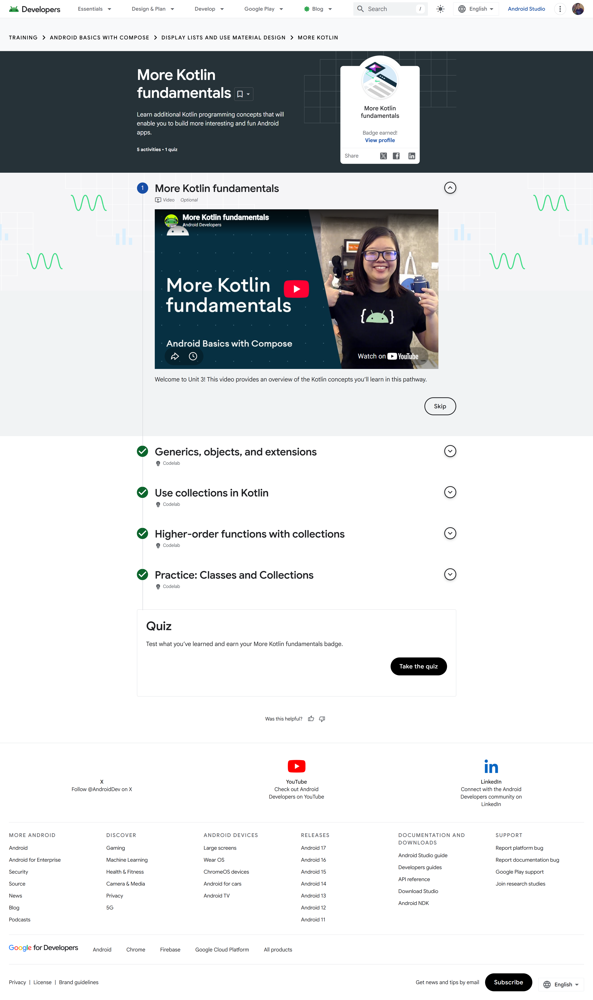
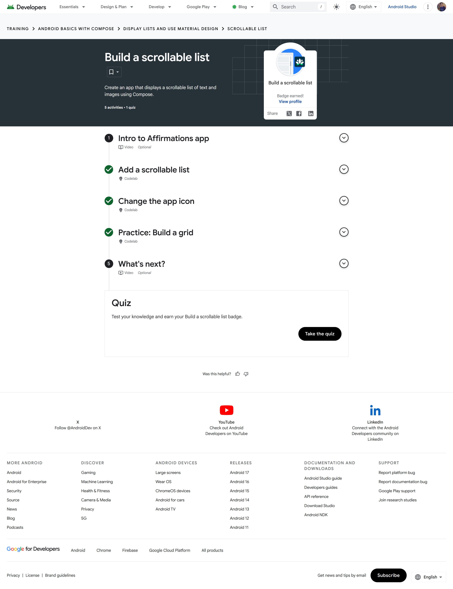
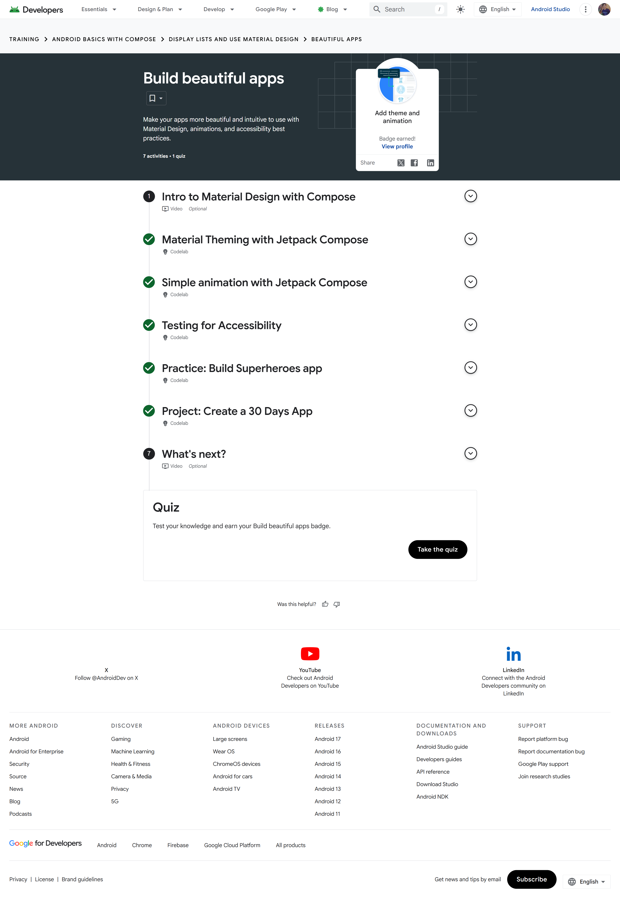

# Module 3 - Display Lists and Use Material Design

> **Android Basics with Compose, Unit 3**
> Kotlin collections, scalable lists, Material theming, animation, and accessibility

[← Module 2](../Module-2-Jetpack-Compose/README.md) | [Portfolio home](../README.md) | [Analysis](Analysis.md) | [Badge evidence](Badge-Evidence/) | [Source code](Source-Code/) | [Next module →](../Module-4-Navigation-App-Architecture/README.md)

## Module overview

This unit moves from small single-screen examples to data-driven interfaces. The pathways strengthen Kotlin collection skills, introduce efficient scrollable lists and grids, and apply Material Design, animation, and accessibility practices to create interfaces that are both consistent and usable.

## Pathway completion

| Pathway | Main topics | Evidence |
|---|---|---|
| More Kotlin fundamentals | Generics, objects, extensions, collections, higher-order functions | [Badge screenshot](Badge-Evidence/more-kotlin-fundamentals.png) |
| Build a scrollable list | Data models, `LazyColumn`, item composition, app icon, grid practice | [Badge screenshot](Badge-Evidence/build-a-scrollable-list.png) |
| Build beautiful apps / Add theme and animation | Material theming, animation, accessibility testing, reusable cards | [Badge screenshot](Badge-Evidence/add-theme-and-animation.png) |

The consolidated [Google Developer Program dashboard](../Assets/google-developer-profile-badges.png) displays the same three Unit 3 achievements on the public developer profile.

## Evidence gallery

| More Kotlin fundamentals | Build a scrollable list | Add theme and animation |
|---|---|---|
|  |  |  |

## Learning outcomes evidenced

- Use generics, objects, extension functions, collections, and higher-order functions to organize Kotlin data operations.
- Represent repeated UI content with a data model rather than duplicating composable markup.
- Display scrollable data with lazy components such as `LazyColumn` and grid equivalents.
- Give repeated items stable identity where appropriate to support efficient updates.
- Centralize color, typography, and shape decisions through a Material theme.
- Use animation to communicate state or hierarchy changes without obscuring content.
- Check semantics, contrast, touch targets, and content descriptions as part of accessibility testing.

## Technical synthesis

### Lazy lists versus eager layouts

A regular `Column` composes all of its children and is suitable for a small, fixed amount of content. A `LazyColumn` composes and lays out visible items as they are needed, making it a better fit for larger or changing collections. The lazy approach improves scalability, but item identity and state must be considered carefully when rows can be inserted, removed, or reordered.

### Data-driven components

Separating a data model from an item composable avoids repeated UI code and makes the same component reusable across a list or grid. Higher-order collection operations such as `map`, `filter`, and sorting functions can transform the data before it reaches the UI. Complex work should not be repeated unnecessarily during recomposition; it belongs in an appropriate state or data layer.

### Theme, animation, and accessibility

A shared Material theme provides consistent design tokens and reduces one-off styling. Animation is strongest when it explains a meaningful transition; excessive motion can distract users and should respect reduced-motion and accessibility needs. Visual polish therefore depends on accessibility and semantic clarity, not only color or movement.

## Included implementation

[`Source-Code/LearningCardsApp`](Source-Code/LearningCardsApp/) is a complete standalone Gradle project implementing the unit concepts as a scrollable study guide. It includes:

- a typed six-item learning-topic data model with stable IDs;
- a `LazyColumn` with stable keys and reusable Material cards;
- animated expand/collapse details with saved per-card state;
- custom Material 3 light and dark color schemes;
- content descriptions and readable interaction labels; and
- catalog unit tests plus a Compose expansion test.

The colored accent, summary and details all come from the model, so repeated UI markup is not duplicated.

## Concepts reviewed

| Area | Technique | Why it matters |
|---|---|---|
| Kotlin | Generic and extension functions | Reusable operations with expressive call sites |
| Collections | Higher-order transformations | Clear filtering, mapping, and aggregation |
| Lists | Lazy composition | More appropriate rendering for repeated or long content |
| Design system | Material theme | Consistent colors, typography, shapes, and component behaviour |
| Motion | Purposeful animation | Communicates change and improves continuity |
| Inclusion | Accessibility testing | Supports users of assistive technology and diverse interaction needs |

## Reviewer checklist

- [x] Three individual pathway screenshots
- [x] Consolidated public-profile badge evidence
- [x] Detailed list, Material Design, animation, and accessibility discussion
- [x] Complete runnable lazy-list and Material Design project
- [x] Unit and Compose UI tests
- [x] Separate [analysis notes](Analysis.md)

---

[← Module 2](../Module-2-Jetpack-Compose/README.md) | [Portfolio home](../README.md) | [Continue to Module 4 →](../Module-4-Navigation-App-Architecture/README.md)
