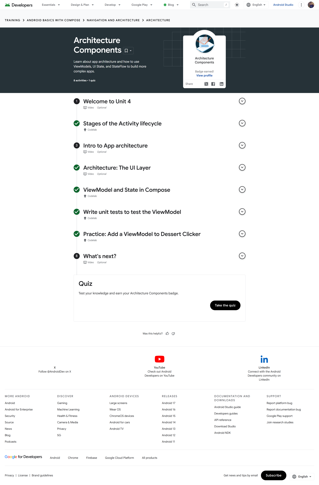
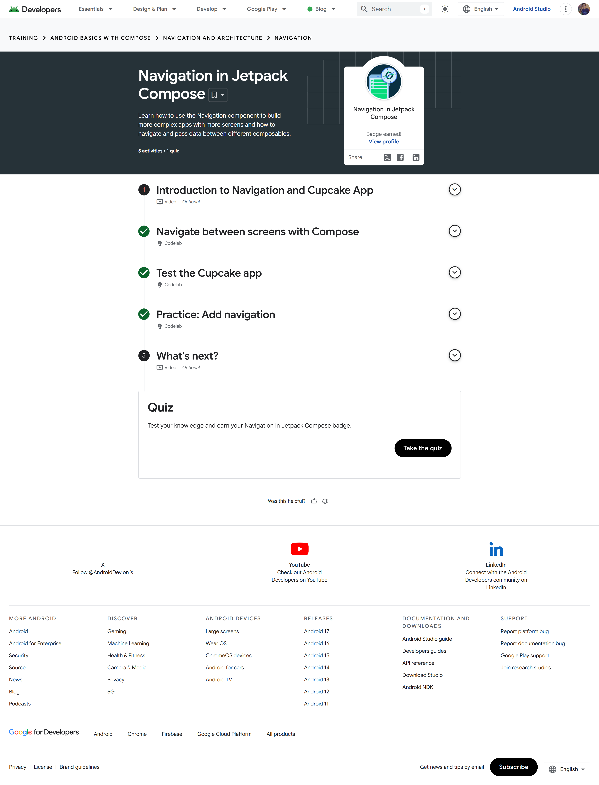
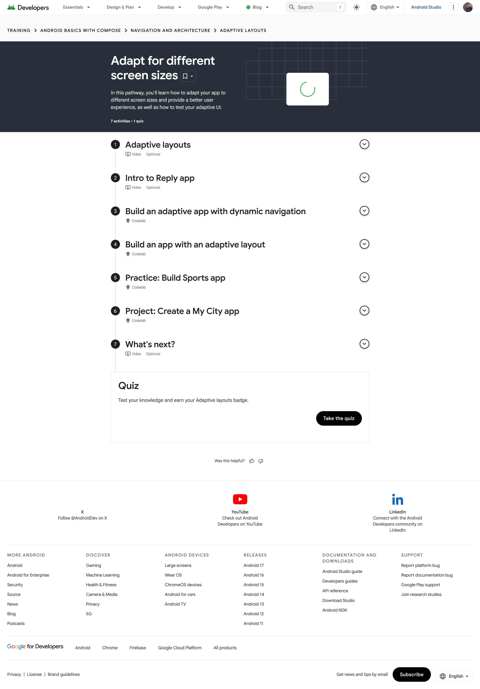

# Module 4 - Navigation and App Architecture

> **Android Basics with Compose, Unit 4**
> Lifecycle awareness, ViewModel concepts, UI state, navigation, and adaptive layouts

[← Module 3](../Module-3-Lists-Material-Design/README.md) | [Portfolio home](../README.md) | [Analysis](Analysis.md) | [Badge evidence](Badge-Evidence/) | [Source code](Source-Code/) | [Reflection →](../Reflection/Reflection.md)

## Module overview

This unit connects individual composables to the wider structure of an Android application. Its pathways cover lifecycle-aware architecture and ViewModel testing, navigation between multiple Compose destinations, and interfaces that adapt to different window sizes and device form factors.

## Pathway completion

| Pathway | Main topics | Evidence |
|---|---|---|
| Architecture Components | Activity lifecycle, UI layer, ViewModel, UI state, StateFlow, unit testing | [Badge screenshot](Badge-Evidence/architecture-components.png) |
| Navigation in Jetpack Compose | Routes, `NavHost`, navigation controller, arguments, back stack, navigation tests | [Badge screenshot](Badge-Evidence/navigation-in-jetpack-compose.png) |
| Adapt for different screen sizes | Window-size classes, dynamic navigation, canonical layouts, adaptive testing | [Badge screenshot](Badge-Evidence/adaptive-layouts.png) |

The [Unit 4 completion screenshot](Screenshots/unit-4-completion.png) records all three pathways at 100%.

## Evidence gallery

| Architecture Components | Navigation in Jetpack Compose | Adaptive layouts |
|---|---|---|
| [](Badge-Evidence/architecture-components.png) | [](Badge-Evidence/navigation-in-jetpack-compose.png) | [](Badge-Evidence/adaptive-layouts.png) |

## Learning outcomes evidenced

- Relate activity lifecycle events to application behaviour and state preservation.
- Separate screen state and UI logic from rendering responsibilities with a ViewModel-oriented UI layer.
- Represent observable screen state with immutable values and a predictable event flow.
- Define Compose destinations and navigation actions while preserving correct back-stack behaviour.
- Pass only the data needed to identify a destination rather than transferring complex mutable objects.
- Select navigation and content arrangements in response to available window size.
- Verify ViewModel logic, navigation behaviour, and adaptive layouts with focused tests.

## Included implementation

[`Source-Code/CourseNavigatorApp`](Source-Code/CourseNavigatorApp/) is a complete standalone Gradle project implementing the unit concepts together:

- an immutable `CourseUiState` exposed through `StateFlow` from a `ViewModel`;
- a catalog kept separate from rendering code and covered by local unit tests;
- Home, topic-list, and parameterized detail destinations using Navigation Compose;
- compact single-pane behaviour for phones and an expanded list-detail layout at 700 dp or wider; and
- a Compose navigation test that checks the start action opens the topic list.

Route arguments carry a small topic identifier; the destination resolves the current data from the catalog rather than receiving a mutable object.

## Technical synthesis

### Local state and ViewModel-owned state

`remember { mutableStateOf(...) }` is appropriate for small, UI-owned values that only need to survive recomposition. A ViewModel is better suited to screen-level state and logic that should survive activity recreation and remain independent of a particular composable instance. The trade-off is additional architecture: ViewModels require explicit state models and event handling, but they improve testability and separation of concerns as a screen grows.

### Navigation as application structure

Compose Navigation models destinations, routes, and back-stack transitions rather than manually replacing screen content. Keeping navigation callbacks at screen boundaries makes individual screens more reusable and easier to test. Passing compact identifiers between destinations is safer than passing large mutable objects because the destination can load the current data from its source of truth.

### Adaptive layouts

Adaptive design is more than uniformly scaling controls. Different window sizes may require different navigation components or content arrangements—for example, a single pane on compact windows and a list-detail layout on expanded windows. Canonical layouts and window-size information support those decisions, but each layout mode still requires testing for content visibility, focus order, and navigation consistency.

## Architecture relationship

```text
User event
    ↓
Composable callback
    ↓
State holder / ViewModel
    ↓
Updated immutable UI state
    ↓
Composable recomposition

Navigation events are handled at the destination boundary,
while adaptive layout decisions respond to available window size.
```

## Concepts and trade-offs

| Technique | Strength | Limitation to manage |
|---|---|---|
| Local Compose state | Minimal setup for component-owned values | Not the right owner for longer-lived screen or domain state |
| ViewModel + observable UI state | Lifecycle-aware separation and testable logic | Requires explicit state/event modelling |
| Navigation Compose | Structured destinations and back-stack handling | Route and argument design must remain consistent |
| Adaptive layouts | Better use of phones, tablets, and foldables | More layout modes increase test coverage requirements |

## Reviewer checklist

- [x] Three individual pathway screenshots
- [x] Unit-level 100% completion screenshot
- [x] Complete runnable navigation and architecture project
- [x] ViewModel, StateFlow, route argument, and adaptive-layout implementation
- [x] Unit and Compose UI tests
- [x] Technical comparison of state ownership, navigation, and adaptive UI
- [x] Separate [analysis notes](Analysis.md)

---

[← Module 3](../Module-3-Lists-Material-Design/README.md) | [Portfolio home](../README.md) | [Continue to reflection →](../Reflection/Reflection.md)
