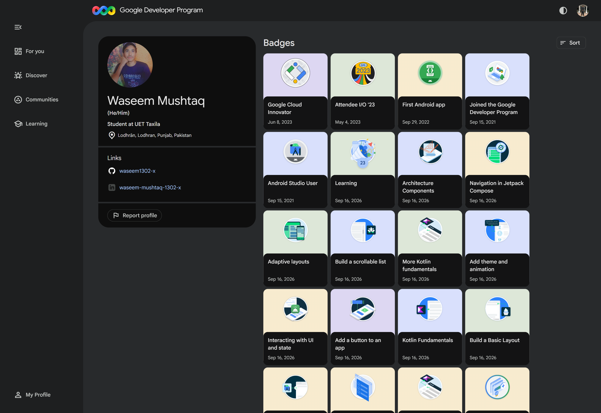

# Android Mobile Application Development Learning Portfolio

> **CDE2313 - Mobile Application Development**
> Assessment 1: Lab Exercises | Individual GitHub Learning Portfolio (15%)

This repository is an evidence-led portfolio of my work across the first four units of Google's **Android Basics with Compose** course. It brings together verified pathway badges, unit-completion screenshots, four runnable Kotlin and Jetpack Compose projects, technical learning notes, analysis prompts, reflection material, references, and Git history in one reviewer-friendly structure.

## Portfolio at a glance

| Item | Details |
|---|---|
| Student | **Waseem Mushtaq** |
| Programme | Bachelor in Computer Science |
| Course | CDE2313 - Mobile Application Development |
| Academic session | 2025/2026, Semester 3 |
| Lecturer | Ts Mohd Zulkifli Mohd Zaki |
| Learning programme | Android Basics with Compose |
| Completed scope | Units 1-4, comprising 12 pathways |
| Badge evidence | 12 individual pathway screenshots plus consolidated profile dashboard |
| Primary technologies | Kotlin, Android Studio, Jetpack Compose, Material 3, Gradle, Git, and GitHub |

### Quick links

- [Public Google Developer profile](https://me.developers.google.com/u/110203555675658597198)
- [GitHub repository](https://github.com/waseem1302-x/mobile-app-learning-portfolio)
- [Module 1 - Your first Android app](Module-1-Android-Basics/README.md)
- [Module 2 - Building app UI](Module-2-Jetpack-Compose/README.md)
- [Module 3 - Display lists and use Material Design](Module-3-Lists-Material-Design/README.md)
- [Module 4 - Navigation and app architecture](Module-4-Navigation-App-Architecture/README.md)
- [Portfolio reflection](Reflection/Reflection.md)
- [APA-style references](References/References.md)

## Learning journey

The four modules show a deliberate progression from language and tooling fundamentals to modern Android UI development and application structure:

| Module | Android Basics with Compose unit | Core technical focus | Completion evidence |
|---|---|---|---|
| [01](Module-1-Android-Basics/README.md) | **Your first Android app** | Kotlin foundations, Android Studio, project structure, Compose layout | [Unit screenshot](Module-1-Android-Basics/Screenshots/unit-1-completion.png) + 3 pathway badges |
| [02](Module-2-Jetpack-Compose/README.md) | **Building app UI** | Kotlin fundamentals, composables, events, state, automated tests | [Unit screenshot](Module-2-Jetpack-Compose/Screenshots/unit-2-completion.png) + 3 pathway badges |
| [03](Module-3-Lists-Material-Design/README.md) | **Display lists and use Material Design** | Collections, lazy lists, theming, animation, accessibility | 3 individual pathway badges |
| [04](Module-4-Navigation-App-Architecture/README.md) | **Navigation and app architecture** | ViewModel concepts, UI state, navigation, adaptive layouts | [Unit screenshot](Module-4-Navigation-App-Architecture/Screenshots/unit-4-completion.png) + 3 pathway badges |

## Verified badge record

The portfolio contains an individual screenshot for every pathway listed below. Each module page embeds its three screenshots and links directly to the original evidence file.

| Unit | Pathway badge | Individual evidence |
|---|---|---|
| 1 | Introduction to programming in Kotlin | [View screenshot](Module-1-Android-Basics/Badge-Evidence/introduction-to-kotlin.png) |
| 1 | Set up Android Studio | [View screenshot](Module-1-Android-Basics/Badge-Evidence/setup-android-studio.png) |
| 1 | Build a Basic Layout | [View screenshot](Module-1-Android-Basics/Badge-Evidence/build-basic-layout.png) |
| 2 | Kotlin Fundamentals | [View screenshot](Module-2-Jetpack-Compose/Badge-Evidence/kotlin-fundamentals.png) |
| 2 | Add a button to an app | [View screenshot](Module-2-Jetpack-Compose/Badge-Evidence/add-a-button-to-an-app.png) |
| 2 | Interacting with UI and state | [View screenshot](Module-2-Jetpack-Compose/Badge-Evidence/interacting-with-ui-and-state.png) |
| 3 | More Kotlin fundamentals | [View screenshot](Module-3-Lists-Material-Design/Badge-Evidence/more-kotlin-fundamentals.png) |
| 3 | Build a scrollable list | [View screenshot](Module-3-Lists-Material-Design/Badge-Evidence/build-a-scrollable-list.png) |
| 3 | Add theme and animation | [View screenshot](Module-3-Lists-Material-Design/Badge-Evidence/add-theme-and-animation.png) |
| 4 | Architecture Components | [View screenshot](Module-4-Navigation-App-Architecture/Badge-Evidence/architecture-components.png) |
| 4 | Navigation in Jetpack Compose | [View screenshot](Module-4-Navigation-App-Architecture/Badge-Evidence/navigation-in-jetpack-compose.png) |
| 4 | Adaptive layouts | [View screenshot](Module-4-Navigation-App-Architecture/Badge-Evidence/adaptive-layouts.png) |

### Consolidated profile evidence

The Google Developer Program dashboard below provides a second, consolidated record of the awarded Android badges. The public profile can be independently reviewed through the link above.

[](Assets/google-developer-profile-badges.png)

## Technical progression

### 1. Kotlin and Android foundations

The portfolio begins with Kotlin syntax, variables, functions, Android Studio setup, project structure, and a minimal Compose activity. The complete Module 1 project demonstrates the Android activity entry point, `setContent`, a reusable `@Composable`, Material theming, `Scaffold`, modifiers, and a preview.

### 2. Declarative UI and state

Module 2 moves from language fundamentals to declarative UI. Its interaction lab implements a dice roller and tip calculator with button events, validated numeric input, `rememberSaveable` state, derived values, and unit/UI test coverage.

### 3. Data-driven lists and Material Design

Module 3 extends the UI model to collections and scrollable content. Its learning-card app uses a typed data model, stable lazy-list keys, Material 3 theming, animated expansion, dark-mode colors, and meaningful accessibility semantics.

### 4. Architecture, navigation, and adaptive layouts

Module 4 connects UI work to application structure. Its course navigator uses a `ViewModel`, immutable `StateFlow`, Navigation Compose routes and arguments, compact single-pane navigation, and an expanded list-detail layout at wider window sizes.

## Source-code evidence

Each module contains a standalone Gradle project that can be opened, built, and tested independently.

| Module | Included implementation | Scope |
|---|---|---|
| 1 | [`FirstAndroidPortfolioApp`](Module-1-Android-Basics/Source-Code/FirstAndroidPortfolioApp/) | Complete Gradle Android project with wrapper, app module, resources, theme, unit test, and instrumented test |
| 2 | [`ComposeInteractionLab`](Module-2-Jetpack-Compose/Source-Code/ComposeInteractionLab/) | Runnable dice roller and tip calculator demonstrating events, input, state, recomposition, and tests |
| 3 | [`LearningCardsApp`](Module-3-Lists-Material-Design/Source-Code/LearningCardsApp/) | Runnable lazy-list app with a data model, Material theme, animation, semantics, and tests |
| 4 | [`CourseNavigatorApp`](Module-4-Navigation-App-Architecture/Source-Code/CourseNavigatorApp/) | Runnable multi-screen app using ViewModel, StateFlow, Navigation Compose, adaptive layout, and tests |

Machine-specific files, generated build outputs, IDE caches, and local SDK paths are intentionally excluded through [`.gitignore`](.gitignore).

## Assessment evidence map

This table is a navigation aid, not a claim of marks. It shows where a reviewer can locate the evidence relevant to each portfolio requirement.

| Assessment area | Evidence in this repository |
|---|---|
| Learning completion | 12 individual pathway screenshots, unit screenshots, consolidated badge dashboard, public developer profile |
| Repository organization | Root index, consistent module folders, evidence directories, source-code directories, reflection, and references |
| Technical discussion | Module READMEs and the four [`Analysis.md`](Module-1-Android-Basics/Analysis.md) files |
| Code and implementation evidence | Four complete Gradle Android projects with source, resources, local tests, UI tests, and reproducible build commands |
| Reflection | [`Reflection/Reflection.md`](Reflection/Reflection.md) |
| Version-control practice | Repository commit history and focused documentation/evidence commits |
| Authenticity | Original Google Developer profile, individual badge pages, unit screenshots, and transparent source-scope notes |

## Repository structure

```text
mobile-app-learning-portfolio/
├── README.md
├── Assets/
│   └── google-developer-profile-badges.png
├── Module-1-Android-Basics/
│   ├── README.md
│   ├── Analysis.md
│   ├── Badge-Evidence/
│   ├── Screenshots/
│   └── Source-Code/FirstAndroidPortfolioApp/
├── Module-2-Jetpack-Compose/
│   ├── README.md
│   ├── Analysis.md
│   ├── Badge-Evidence/
│   ├── Screenshots/
│   └── Source-Code/ComposeInteractionLab/
├── Module-3-Lists-Material-Design/
│   ├── README.md
│   ├── Analysis.md
│   ├── Badge-Evidence/
│   ├── Screenshots/
│   └── Source-Code/LearningCardsApp/
├── Module-4-Navigation-App-Architecture/
│   ├── README.md
│   ├── Analysis.md
│   ├── Badge-Evidence/
│   ├── Screenshots/
│   └── Source-Code/CourseNavigatorApp/
├── Reflection/
│   └── Reflection.md
└── References/
    └── References.md
```

## Building and running the Android projects

Open any project folder listed in the source-code table directly in Android Studio and allow Gradle sync to finish. Select a USB-debugging-enabled Android device, then choose **Run app**. Each project can also be verified from a configured PowerShell terminal:

```powershell
cd <project-folder>
.\gradlew.bat testDebugUnitTest
.\gradlew.bat assembleDebug assembleDebugAndroidTest
```

Android Studio's bundled JDK and a locally installed Android SDK are required. A `local.properties` file is deliberately not committed because it contains a machine-specific SDK path. Device screenshots should be captured only from a genuine app run; none of the learning or app evidence in this repository is synthetically generated.

## Reflection and academic integrity

The documentation summarizes demonstrable technical concepts and points to the corresponding evidence. The screenshots and badges represent completed learning activity on the linked Google Developer profile; no badge or completion evidence has been synthetically created. Personal critical reflection—such as individual challenges, decisions, strengths, and future improvements—remains clearly separated in [`Reflection/Reflection.md`](Reflection/Reflection.md) and the module analysis files so it can be reviewed as student-authored work.

## References

The portfolio is based on official Android and Kotlin learning resources. Full APA-style entries are listed in [`References/References.md`](References/References.md).

---

**Suggested review order:** [Module 1](Module-1-Android-Basics/README.md) → [Module 2](Module-2-Jetpack-Compose/README.md) → [Module 3](Module-3-Lists-Material-Design/README.md) → [Module 4](Module-4-Navigation-App-Architecture/README.md) → [Reflection](Reflection/Reflection.md)
